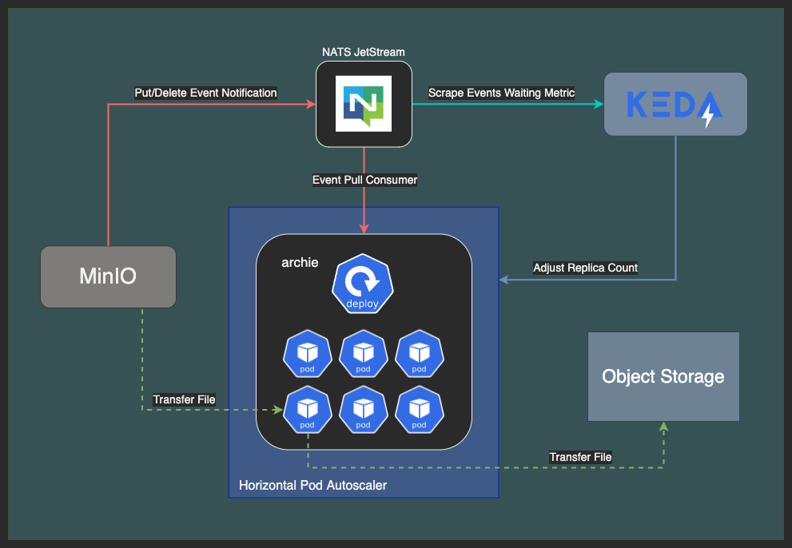

# archie

## summary 

A file archiver for Kubernetes built around MinIO and our scalable archie worker used to archie files 
from MinIO source buckets to any S3 compatible or Google Cloud Storage destination bucket by way of 
MinIO's bucket event notifications, NATS JetStream's durable streams, and KEDA auto-scaling.

app features:
* replicate bucket data from minio sources
  * copy and remove 
* replicate bucket data to multiple destinations
  * minio or any aws s3 compatible
  * google-storage
* async healthcheck server
* prometheus metrics server
* nats jetstream provisioning
* efficient queue pull consumer
* graceful shutdown wait timer
* ignore lifecycle expirations
* exclude paths with pcre regex

## detailed

A MinIO bucket can be configured to send bucket event notifications for (put & delete) activity to a NATS Jetstream cluster stream.
The NATS Jetstream stream provides a place for the notification messages to queue where they are stored on persistent storage and it guarantees
exactly-once delivery to the archie worker pool using a server-side max timeout retry. The archie workers use the same 
NATS Jetstream durable consumer, each one requesting to pull a single event notification message at a time. In the event of a failure archie will
inform the NATS server of the failure and the client-side will request a retry using a more rapid exponential backoff. 
The process with only give up and terminate retries after the [maxRetries](CONFIGURE.md#server-options) in a few situations, 
if the source file in MinIO doesn't exist on a copy, or if the destination file doesn't exist on a delete, any other errors 
or timeouts will result in retrying forever or until the message is expired from the NATS Jetstream stream. 

## notes

The MinIO server does not need to be in Kubernetes, but it does need to be able to communicate with the NATS cluster to deliver the event 
notifications to the stream. The NATS cluster could also exist outside of Kubernetes, but I have not tested it.

## deploy

Check out the helm chart [INSTALL.md](INSTALL.md)

chart features:
* archie worker deployment
* keda `ScaledObject` deployment scaler
* prometheus `ServiceMonitor` metrics
* prometheus `PrometheusRules` alerts

## usage

For CLI and `config.yaml` settings visit [CONFIGURE.md](CONFIGURE.md)

## queue

Use [NATS JetStream](https://docs.nats.io/nats-concepts/jetstream) to queue bucket event notifications from MinIO.

## autoscaling

Use KEDA's [NATS JetStream Scaler](https://keda.sh/docs/latest/scalers/nats-jetstream/) to scale the workers.

## development

Check out [DEVELOPER.md](DEVELOPER.md)

## known issues

* NATS JetStream stream's first sequence metric is unstable - TODO: Create PR (monitoring issue only)
* PCRE Regex module somewhat limits our build OS and ARCH - [INFO](https://gitea.arsenm.dev/Arsen6331/pcre#supported-goos-goarch)
* KEDA needed a patch to fix the scaler for using jetstream in a cluster - [PR #3564](https://github.com/kedacore/keda/pull/3564) (merged)
* NATS-Exporter needed to pass the `first_seq` stream info - [PR #190](https://github.com/nats-io/prometheus-nats-exporter/pull/190) (merged)
* MinIO doesn't reconnect to NATS server if it is down for a while - [PR #16050](https://github.com/minio/minio/pull/16050) (merged)
